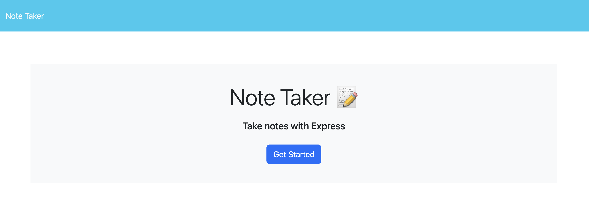
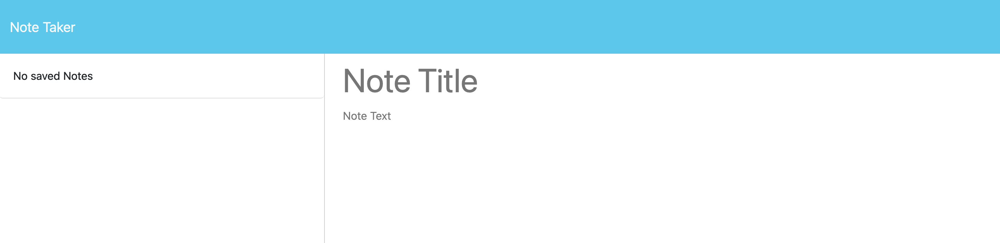
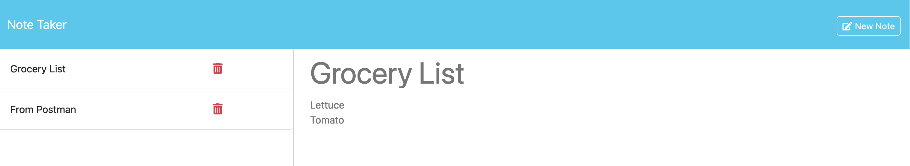
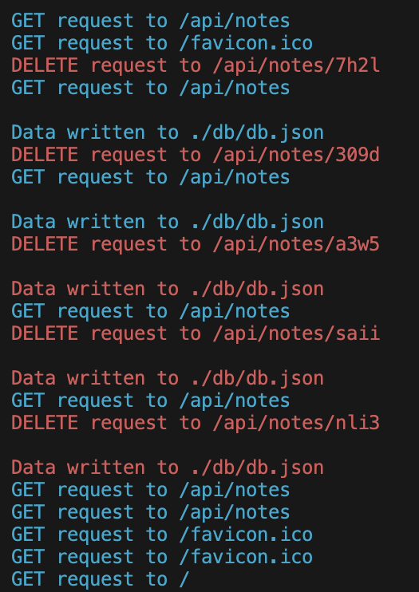
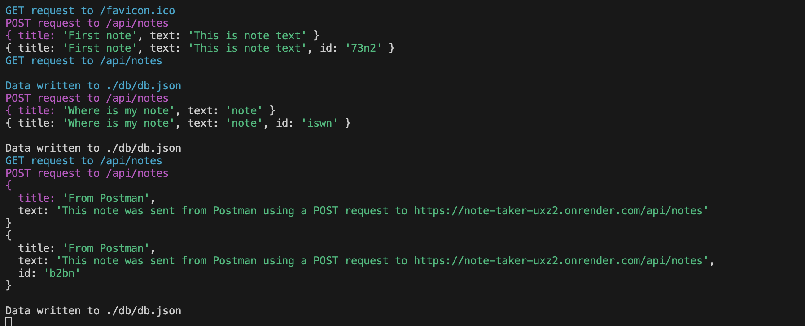
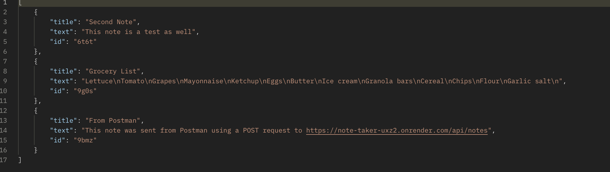
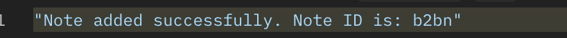
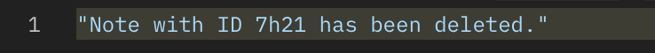

<a name="readme-top"></a>

[![Contributors][contributors-shield]][contributors-url]
[![Forks][forks-shield]][forks-url]
[![Stargazers][stars-shield]][stars-url]
[![Issues][issues-shield]][issues-url]
[![MIT License][license-shield]][license-url]
[![LinkedIn][linkedin-shield]][linkedin-url]
</br>


<br />
<div align="center">
  <a href="https://github.com/beckpull/note-taker">


<h1 align="center">Note Taker</h1>

  <p align="center">
A simple and easy-to-use note-taking application for you to organize your thoughts and keep track of tasks you need to complete!
    <br />
    <a href="https://github.com/beckpull/note-taker"><strong>Explore the docs »</strong></a>
    <br />
    <br />
    <a href="https://github.com/beckpull/note-taker/issues">Report Bug</a>
    ·
    <a href="https://github.com/beckpull/note-taker/issues">Request Feature</a>
  </p>
</div>

</br>
</br>

<!-- TABLE OF CONTENTS -->
<details>
  <summary>Table of Contents</summary>
  <ol>
    <li>
      <a href="#about-the-project">About The Project</a>
      <ul>
        <li><a href="#built-with">Built With</a></li>
      </ul>
    </li>
    <li>
      <a href="#getting-started">Getting Started</a>
      <ul>
        <li><a href="#prerequisites">Prerequisites</a></li>
        <li><a href="#installation">Installation</a></li>
      </ul>
    </li>
    <li><a href="#usage">Usage</a></li>
    <li><a href="#roadmap">Roadmap</a></li>
    <li><a href="#contributing">Contributing</a></li>
    <li><a href="#license">License</a></li>
    <li><a href="#contact">Contact</a></li>
     <li><a href="#acknowledgments">Acknowledgments</a></li>
  </ol>
</details>

</br>
</br>

<!-- ABOUT THE PROJECT -->
## About The Project

- This application is geared towards anybody looking for a simple and easy-to-use note taking application that will save notes until the user is ready to delete them.

- The goal of this application is for users to be able to store all of their busy thoughts onto one page inroder to help with time maagement and task prioritization. 

<p align="right">(<a href="#readme-top">back to top</a>)</p>


### Built With

* 
* 
* ![NodeJS]
* ![jest-shield]


<p align="right">(<a href="#readme-top">back to top</a>)</p>

<!-- <!-- GETTING STARTED -->
## Getting Started

<p align="center"><i><strong>✨ Everything you need to know ✨</strong></i></p>
<p align="center">There are no installation instructions for any client side operations. This section will only apply for developers wanting to set up their own local server to run this application.
</p>


### Prerequisites

There is an Express.js dependency (as well as the "generate-unique-id" npm package) to run the server side of this application.

### Installation

_To get a local copy up and running follow these simple example steps:_

1. Clone the repo
   ```sh
   HTTP: git clone https://github.com/beckpull/note-taker.git
   SSH: git clone git@github.com:beckpull/note-taker.git
   ```
2. Install all necessary NPM packages
   ```sh
   npm i
   ```
3. Node `server.js`
   ```js
   node server.js
   ```

<p align="right">(<a href="#readme-top">back to top</a>)</p> 

<!-- USAGE EXAMPLES -->
## Usage

<div align="center">
  <a href="https://note-taker-uxz2.onrender.com">
    <p>Here is what the webpage will look like upon opening:</p>
    
  </a>
    </br></br>
  <a href="https://note-taker-uxz2.onrender.com/notes">
    <p>Once "Get Started" is selected, you will be brought tho this page where you can then start typing and saving notes:</p>
    
  </a>
    </br></br>
  <a href="https://note-taker-uxz2.onrender.com/notes">
    <p>Once entering notes, come back to the page for easy note viewing ✨</p>
    
  </a>

</div>
<p align="right">(<a href="#readme-top">back to top</a>)</p> 

<!-- ROADMAP -->
## Developer Tools

<div align="center">
  I have added in custom middleware so users on the server side can see in clearer detail which requests are being made to the server and what they all entail. I have added custom colors to each type of request as well as identifiers for each note edited.
  </br></br>

  
  

  Using Postman to test the /api/notes path will result in a JSON formatted list of all saved notes in the database.

  

  And, I added console logs there too in order to ensure requests were getting through to the server correctly:

  
  
</div>
<p align="right">(<a href="#readme-top">back to top</a>)</p>

<!-- CONTRIBUTING -->
## Contributing

Contributions are what make the open source community such an amazing place to learn, inspire, and create. Any contributions you make are **greatly appreciated**!

_If you have a suggestion that would make this better, please fork the repo and create a pull request. You can also simply open an issue with the tag "enhancement".
Don't forget to give the project a star! Thanks again!_

1. Fork the Project
2. Create your Feature Branch (`git checkout -b feature/NewFeature`)
3. Commit your Changes (`git commit -m 'Added ______ , NewFeature'`)
4. Push to the Branch (`git push origin feature/NewFeature`)
5. Open a Pull Request

See the [open issues](https://github.com/beckpull/note-taker/issues) for a full list of proposed features (and known issues).

<p align="right">(<a href="#readme-top">back to top</a>)</p>

<!-- LICENSE -->
## License

<p align='center'>Distributed under the MIT License. See `LICENSE.txt` for more information.</p>
<p align='center'>© Beck Feltman · All rights reserved.</p>

<p align="right">(<a href="#readme-top">back to top</a>)</p>

<!-- CONTACT -->
## Contact

**Rebecca Feltman** - [Email me](mailto:beckpull@icloud.com) - or check me out on [GitHub!](https://github.com/beckpull) 

>Repository Link: [https://github.com/beckpull/note-taker](https://github.com/beckpull/note-taker)


<p align="right">(<a href="#readme-top">back to top</a>)</p>

<!-- ACKNOWLEDGMENTS -->
## Acknowledgments

* This README file template was created by [@othneildrew](https://github.com/othneildrew) - the original can be found [here](https://github.com/othneildrew/Best-README-Template)

#### Disclaimer: 
> I utilized several articles from sources such as (but not limited to) Stack Overflow, W3Schools, and MDN Web Docs **as references** for the javascript code attached. 
>
>**All of the utilized information has been altered in order to fit this project. This repository contains _solely_ my own work.** 

<p align="right">(<a href="#readme-top">back to top</a>)</p>


<!-- MARKDOWN LINKS & IMAGES -->
<!-- https://www.markdownguide.org/basic-syntax/#reference-style-links -->
[contributors-shield]: https://img.shields.io/github/contributors/beckpull/note-taker.svg?style=for-the-badge
[contributors-url]: https://github.com/beckpull/note-taker/graphs/contributors
[forks-shield]: https://img.shields.io/github/forks/beckpull/note-taker.svg?style=for-the-badge
[forks-url]: https://github.com/beckpull/note-taker/network/members
[stars-shield]: https://img.shields.io/github/stars/beckpull/note-taker.svg?style=for-the-badge
[stars-url]: https://github.com/beckpull/note-taker/stargazers
[issues-shield]: https://img.shields.io/github/issues/beckpull/note-taker.svg?style=for-the-badge
[issues-url]: https://github.com/beckpull/note-taker/issues
[license-shield]: https://img.shields.io/github/license/beckpull/note-taker.svg?style=for-the-badge
[license-url]: https://github.com/beckpull/note-taker/blob/main/LICENSE
[product-screenshot]: images/screenshot.png
[NodeJS]: https://img.shields.io/badge/node.js-6DA55F?style=for-the-badge&logo=node.js&logoColor=white
[Node-url]: https://nodejs.org/en
[JQuery.com]: https://img.shields.io/badge/jQuery-0769AD?style=for-the-badge&logo=jquery&logoColor=white
[JQuery-url]: https://jquery.com 
[Bulma]: https://img.shields.io/badge/bulma-00D0B1?style=for-the-badge&logo=bulma&logoColor=white
[linkedin-shield]: https://img.shields.io/badge/linkedin-%230077B5.svg?style=for-the-badge&logo=linkedin&logoColor=white
[linkedin-url]: https://linkedin.com/in/beckpull/
[stackoverflow-shield]: https://img.shields.io/badge/-Stackoverflow-FE7A16?style=for-the-badge&logo=stack-overflow&logoColor=white
[jest-shield]: https://img.shields.io/badge/-jest-%23C21325?style=for-the-badge&logo=jest&logoColor=white
[inquirer-shield]: https://img.shields.io/badge/dependency-inquirer-black
[inquirer-url]: https://www.npmjs.com/package/inquirer
